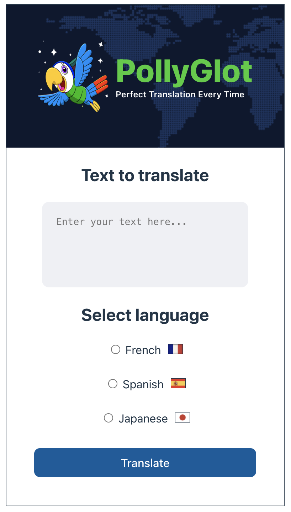

# 🦜 PollyGlot – Translator App

**PollyGlot** is a simple React app that translates English text into **French**, **Spanish**, or **Japanese** using OpenRouter's LLM API.

## 🚀 Features

* Translates input text using `deepseek-chat-v3-0324`
* Choose from 3 target languages
* Reset and translate again easily
* Clean UI with helpful visuals

## 🛠️ Tech Stack

* React (with hooks)
* OpenAI SDK via [OpenRouter](https://openrouter.ai)
* Vite
* Custom assets (flags, parrot, world map)

## 🔑 Setup

1. Clone the repo & install:

   ```bash
   npm install
   ```

2. Add a `.env` file with:

   ```
   VITE_API_KEY=your_openrouter_api_key
   ```

3. Start the app:

   ```bash
   npm run dev
   ```


